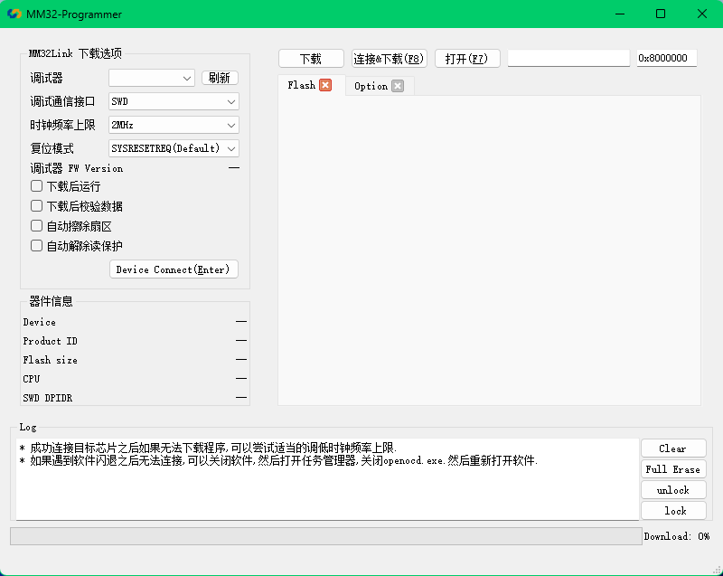

# MM32Program 说明

### 发行版本  
- MM32 编程器 (Python 版) 

预览图

## Getting started

## 虚拟环境

pip install virtualenv

### 创建
virtualenv venv

### 激活
.\venv\Scripts\activate.bat

### 退出
.\venv\Scripts\deactivate.bat